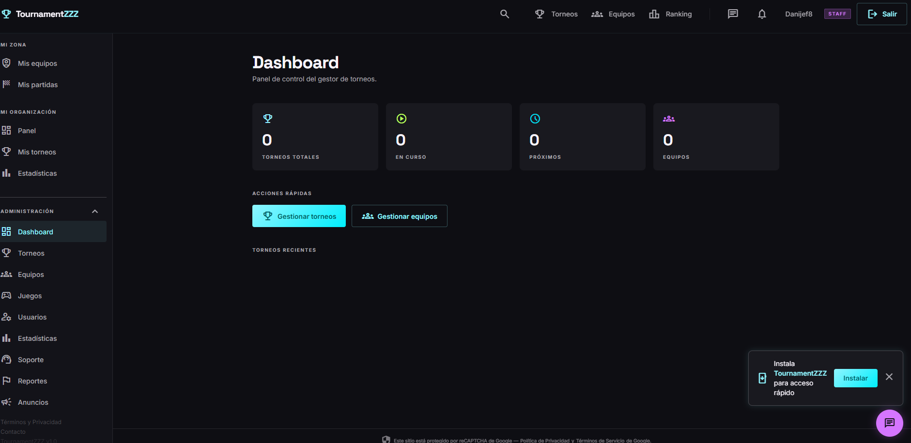
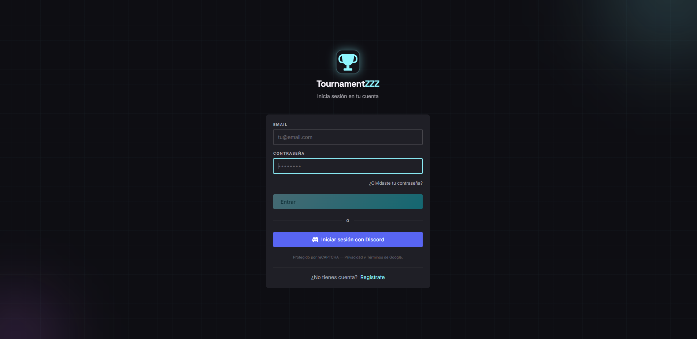

<p align="center">
  
</p>

<p align="center">
  <a href="https://github.com/dani-b-g"></a>
  <a href="https://www.linkedin.com/in/daniel-b-g/"></a>
  <a href="https://tournamentzzz.win"></a>
</p>

<h3 align="center">Frontend leadership, Angular architecture and product-minded engineering.</h3>

<p align="center">
  I build scalable, maintainable and observable web platforms with a strong focus on Angular, microfrontend architecture, accessibility, developer experience and cloud-ready delivery.
</p>

---

## ⚡ About me

- **Tech Lead Frontend** with **7+ years of experience** building modern web applications.
- Mainly focused on **Angular**, frontend architecture, design systems, microfrontends and scalable UI platforms.
- Comfortable moving across the stack with **NestJS**, **PostgreSQL**, Docker-based deployments and cloud/container platforms.
- Strong interest in **observability**, **accessibility**, automation and tooling that makes teams faster.
- Currently building **[TournamentZZZ](https://tournamentzzz.win)** — a tournament management platform for communities, teams and competitive events.

---

## 🧩 Featured side project — TournamentZZZ

<p align="center">
  <a href="https://tournamentzzz.win">
    
  </a>
</p>

**TournamentZZZ** is a full web platform for creating, organizing and managing tournaments from a clean, fast and installable PWA experience.

It includes tournament administration, team management, roles, notifications, mailing flows and integrations designed for online communities and competitive environments.

### Core features

- Tournament creation and management.
- Team registration and team administration.
- Admin/staff roles and protected management areas.
- Installable **PWA** experience.
- Notifications and mailing workflows.
- Discord integration through **Discord SDK**.
- Containerized deployment using **Docker** and **Coolify**.

### Stack

<p>
  
  
  
  
  
  
  
</p>

<p align="center">
  
  
</p>

---

## 🛠️ Tech stack

### Frontend

<p>
  
  
  
  
  
  
  
  
  
</p>

### Architecture, backend & delivery

<p>
  
  
  
  
  
  
  
  
  
  
</p>

### Observability, quality & testing

<p>
  
  
  
  
  
  
  
  
  
  
  
</p>

---

## 🚀 Featured repositories

<table>
  <tr>
  <td width="50%">
      <h3><a href="https://github.com/dani-b-g/it-tools">it-tools</a></h3>
      <p>Collection of useful tools and utilities for developers and technical workflows.</p>
      <p><strong>Focus:</strong> productivity · utilities · DX</p>
    </td>
    <td width="50%">
      <h3><a href="https://github.com/dani-b-g/pa11y-dashboard-noMongo">pa11y-dashboard-noMongo</a></h3>
      <p>Accessibility dashboard based on Pa11y, adapted to work without MongoDB.</p>
      <p><strong>Focus:</strong> accessibility · dashboards · quality</p>
    </td>
  </tr>
</table>

---

## 🎧 Now playing

<!--
  Spotify setup:
  1. Connect your Spotify account with spotify-github-profile.
  2. Copy the generated uid.
  3. Replace YOUR_SPOTIFY_UID in both URLs below.
-->

<p align="center">
  <a href="https://spotify-github-profile.kittinanx.com/api/view?uid=danijef8&redirect=true">
    
  </a>
</p>

---

## 📊 GitHub activity

<p align="center">
  
</p>

<p align="center">
  
  
</p>

<p align="center">
  
  
</p>

---

## 🧠 Engineering principles

```txt
Frontend leadership      → scalable systems, clear ownership and technical direction
Angular architecture     → modularity, performance, maintainability and DX
Microfrontends           → independent delivery without losing product consistency
Observability            → traces, logs, metrics and actionable dashboards
Accessibility            → inclusive interfaces as a default quality standard
Automation               → fewer manual tasks, more reliable delivery
```

---

<p align="center">
  <strong>Building clean interfaces, reliable platforms and tools that help teams move faster.</strong>
</p>

<p align="center">
  <a href="https://tournamentzzz.win">TournamentZZZ</a> ·
  <a href="https://www.linkedin.com/in/daniel-b-g/">LinkedIn</a> ·
  <a href="https://github.com/dani-b-g?tab=repositories">Repositories</a>
</p>

<p align="center">
  
</p>
